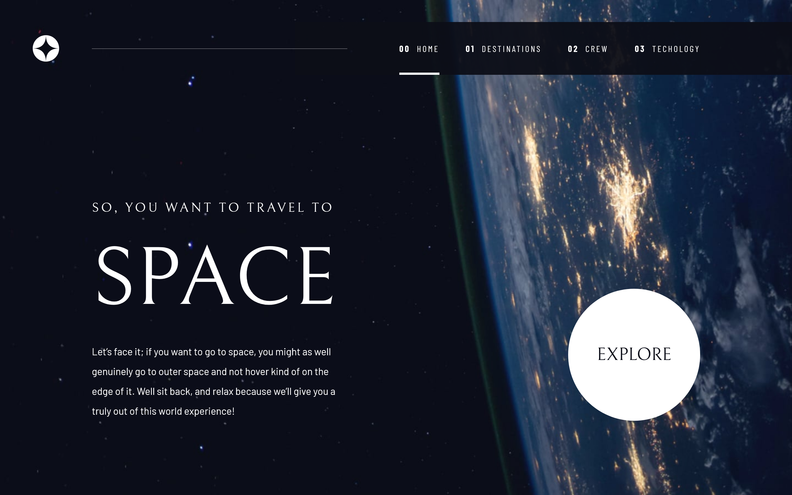

<!-- Please update value in the {}  -->

<h1 align="center">Space Travel</h1>

<div align="center">
   Solution for a challenge from  <a href="https://www.frontendmentor.io" target="_blank">frontendmentor.io</a>.
</div>

<div align="center">
  <h3>
    <a href="https://space-travel-wine.vercel.app/">
      Demo
    </a>
    <span> | </span>
    <a href="https://github.com/HermanLD/space-travel">
      Solution
    </a>
    <span> | </span>
    <a href="https://www.frontendmentor.io/challenges/space-tourism-multipage-website-gRWj1URZ3">
      Challenge
    </a>
  </h3>
</div>

<!-- TABLE OF CONTENTS -->

## Table of Contents

- [Overview](#overview)
  - [Built With](#built-with)
- [Features](#features)
- [How to use](#how-to-use)
- [Contact](#contact)
- [Acknowledgements](#acknowledgements)

<!-- OVERVIEW -->

## Overview



A Space travel website.

- Got to use the negative margin technigue for the overlapping hero photo.
- Manipulating the DOM working with tailwindcss and vanilla javascript.
- Becoming more efficient at setting up multi-page site.
- Responsive CSS Grid layout.

### Built With

<!-- This section should list any major frameworks that you built your project using. Here are a few examples.-->

- [Eleventy](https://www.11ty.dev/)
- [Tailwindcss](https://tailwindcss.com/)

## How To Use

To clone and run this application, you'll need [Git](https://git-scm.com) and [Node.js](https://nodejs.org/en/download/) (which comes with [npm](http://npmjs.com)) installed on your computer. From your command line:

```bash
# Clone this repository
$ git clone https://github.com/HermanLD/

# Install dependencies
$ npm install

# Compiles and hot-reloads Eleventy for development
$ npm run dev

# Run tailwind CLI watch mode
$ npm run css:dev

# Compiles and minifies for production
$ npm run build

```

## Customize configuration

See [Configuration Reference](https://www.11ty.dev/docs/).

## Acknowledgements

<!-- This section should list any articles or add-ons/plugins that helps you to complete the project. This is optional but it will help you in the future. For example: -->

- [Modern Fluid Typography Using CSS Clamp](https://www.smashingmagazine.com/2022/01/modern-fluid-typography-css-clamp/)
- [An Eleventy Starter with Tailwind CSS and Alpine.js](https://css-tricks.com/eleventy-starter-with-tailwind-css-alpine-js/)
- [Wes Bos CSS Grid Course](https://cssgrid.io/)
- [Frontend Mentor](https://www.frontendmentor.io/)

## Contact

- Website [My Portfolio](https://portfolio-olive-alpha.vercel.app/)
- GitHub [@HermanLD](https://github.com/HermanLD/)
- Twitter [@DardonHerman](https://twitter.com/DardonHerman/)
- Linkedin [Herman Dardon](https://www.linkedin.com/in/herman-dardon/)

## Troubleshooting

- Environment variable issue in [Windows](https://github.com/gregwolanski/eleventy-tailwindcss-alpinejs-starter/issues/3).
- Running eleventy serve & tailwindcss watch simultaniously in npm scripts:
  Original setup had tailwind and 11ty run in the same script but when run, would freeze.
  Now you will have to split the terminal and run dev and start separately.
